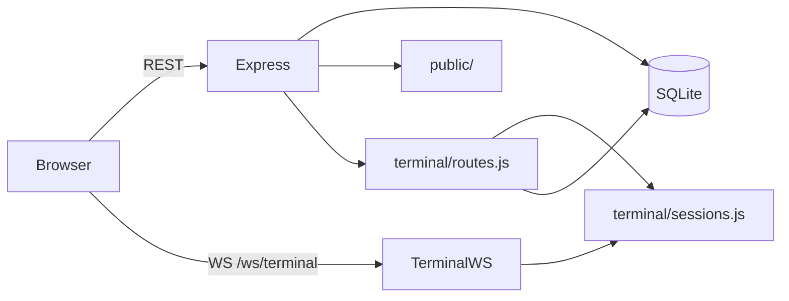
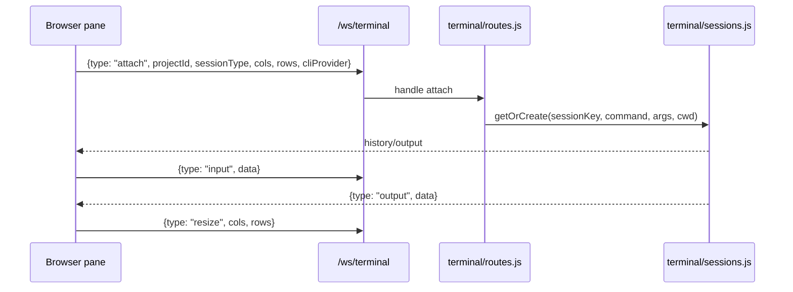
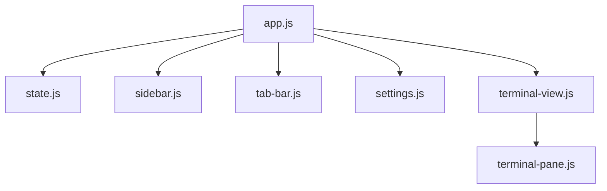

# Codebuilder Architecture

Codebuilder is a small project-based terminal workspace. It keeps a project sidebar, a split terminal, resumable assistant sessions, and a minimal settings screen for choosing the CLI provider.

## Server Architecture

### Unified App Server



`server/index.js` serves the frontend, mounts the project/session routes from `terminal/routes.js`, exposes `/api/settings`, and upgrades `/ws/terminal` for PTY-backed sessions.

## Data Model

### Projects

Each project represents a working directory the user can attach terminals to.

### Settings

Settings are simple key/value rows. The current app stores `cli_provider` there.

### Session Metadata

The app persists two lightweight session lists per project:

- `archived_sessions` for hidden historical sessions
- `managed_sessions` for sessions explicitly touched by Codebuilder

```sql
CREATE TABLE projects (
  id TEXT PRIMARY KEY,
  name TEXT NOT NULL,
  cwd TEXT NOT NULL,
  created_at INTEGER NOT NULL
);

CREATE TABLE settings (
  key TEXT PRIMARY KEY,
  value TEXT NOT NULL
);

CREATE TABLE archived_sessions (
  project_id TEXT NOT NULL REFERENCES projects(id) ON DELETE CASCADE,
  session_id TEXT NOT NULL,
  archived_at INTEGER NOT NULL,
  PRIMARY KEY (project_id, session_id)
);

CREATE TABLE managed_sessions (
  project_id TEXT NOT NULL REFERENCES projects(id) ON DELETE CASCADE,
  session_id TEXT NOT NULL,
  PRIMARY KEY (project_id, session_id)
);
```

## REST API

### Projects

- `GET /api/projects`
- `POST /api/projects`
- `DELETE /api/projects/:id`
- `GET /api/fs`

### Terminal Sessions

- `GET /api/projects/:id/sessions`
- `GET /api/projects/:id/claude-sessions`
- `GET /api/projects/:id/archived-sessions`
- `POST /api/projects/:id/sessions/:sessionId/archive`
- `DELETE /api/projects/:id/sessions/:sessionId/archive`
- `POST /api/projects/:id/sessions/:sessionId/managed`
- `DELETE /api/projects/:id/sessions/:sessionId`

### Settings

- `GET /api/settings`
- `PUT /api/settings`

## WebSocket Protocol

`/ws/terminal` is a per-pane transport between xterm.js and the server PTY.



## Frontend Architecture



### State

The shared frontend state contains:

- `projects`
- `activeProjectId`
- `activeTab`
- `cliProvider`

### Terminal Flow

- The sidebar selects the active project
- `terminal-view.js` reconnects both panes when the project changes
- The settings view updates `cliProvider`
- Changing the provider reconnects only the assistant pane

## Projects

Projects are imported once from `terminal/projects.json` if that file exists. After migration, the file is renamed to `.bak`, and a starter project is created from `process.cwd()` if the database is empty.

## Session Metadata

Archived and managed session ids are stored separately from the PTY process pool. That keeps the live process registry in memory while preserving lightweight UI preferences across restarts.
