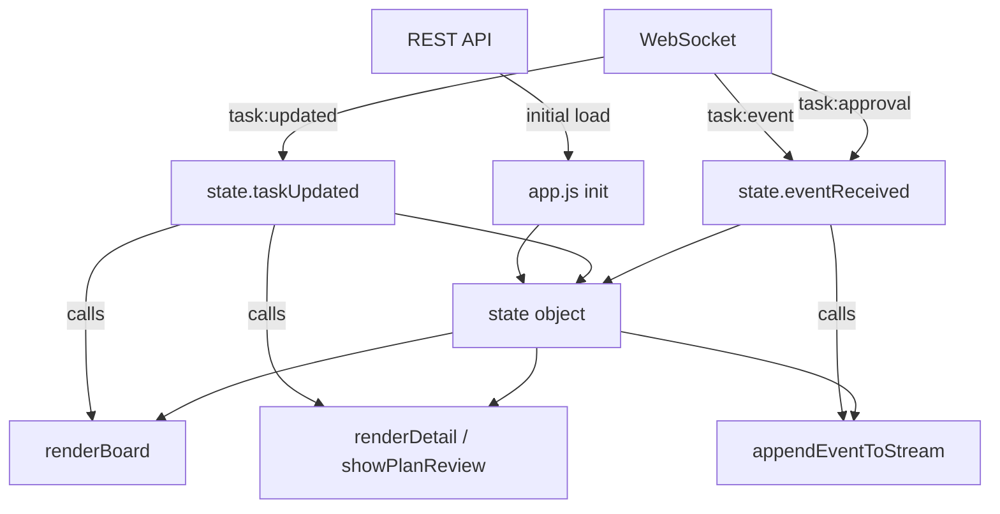

# State Management

How the frontend manages state without a framework.

## Architecture



## State Object

```js
{
  tasks: [],                    // Task[] — all tasks from API
  events: new Map(),            // Map<taskId, Event[]>
  selectedTaskId: null,         // string | null
}
```

Mutations are direct property assignments. After mutation, the
responsible function calls the targeted render function.

## Why No Immutability

There is no virtual DOM to diff. Each mutation triggers exactly
the render function for the affected view. We know at write time
which view is affected:

- `taskUpdated` → `renderBoard()` + `renderDetail()` if selected
- `eventReceived` → `appendEventToStream()` if selected

## Board Rendering

`renderBoard()` clears all 4 column containers and re-populates
them by iterating `state.tasks`. Failed and cancelled tasks go
to the "done" column.

## WebSocket

Single connection, auto-reconnects every 2s on close. All messages
are JSON with a `type` discriminator. The connection status badge
toggles between "Connected" (green) and "Disconnected" (red).

## Initial Load

1. `app.js` calls `fetchTasks()` to populate `state.tasks`
2. For any running tasks, events are pre-fetched
3. Board is rendered
4. WebSocket connects for live updates
