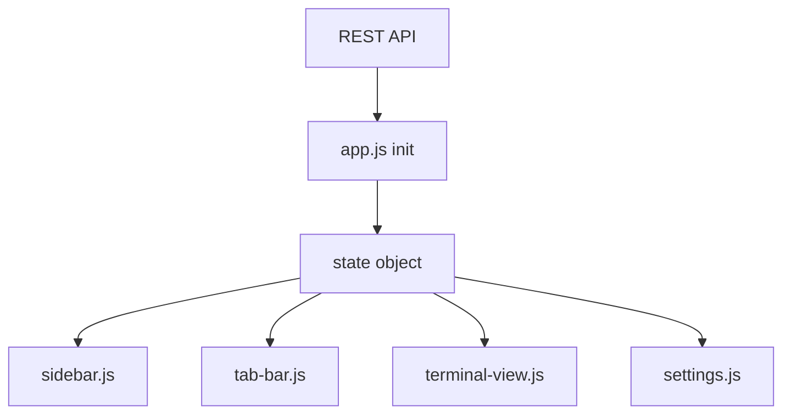

# State Management

How the reduced frontend keeps the active project, tab, and CLI provider in sync.

## Architecture



## State Object

```js
{
  projects: [],
  activeProjectId: null,
  activeTab: 'terminal',
  cliProvider: 'claude',
}
```

Mutations are direct assignments. Each caller updates the specific UI it owns.

## Initial Load

1. `app.js` fetches projects and restores `activeProjectId` from local storage
2. `app.js` fetches settings and applies `cliProvider`
3. Sidebar and tab bar render from shared state
4. `terminal-view.js` initializes the active project's bash and assistant panes

## Project Switching

- The sidebar writes `state.activeProjectId`
- `app.js` forwards that project to `terminal-view.js`
- Existing PTY connections reconnect under the new project's workspace

## Tab Switching

### Terminal

- First visit initializes terminal panes
- Later visits call `fitTerminals()` so xterm resizes cleanly

### Settings

- `settings.js` re-syncs the radio state from `state.cliProvider`
- Saving a new provider updates shared state and reconnects the assistant pane
