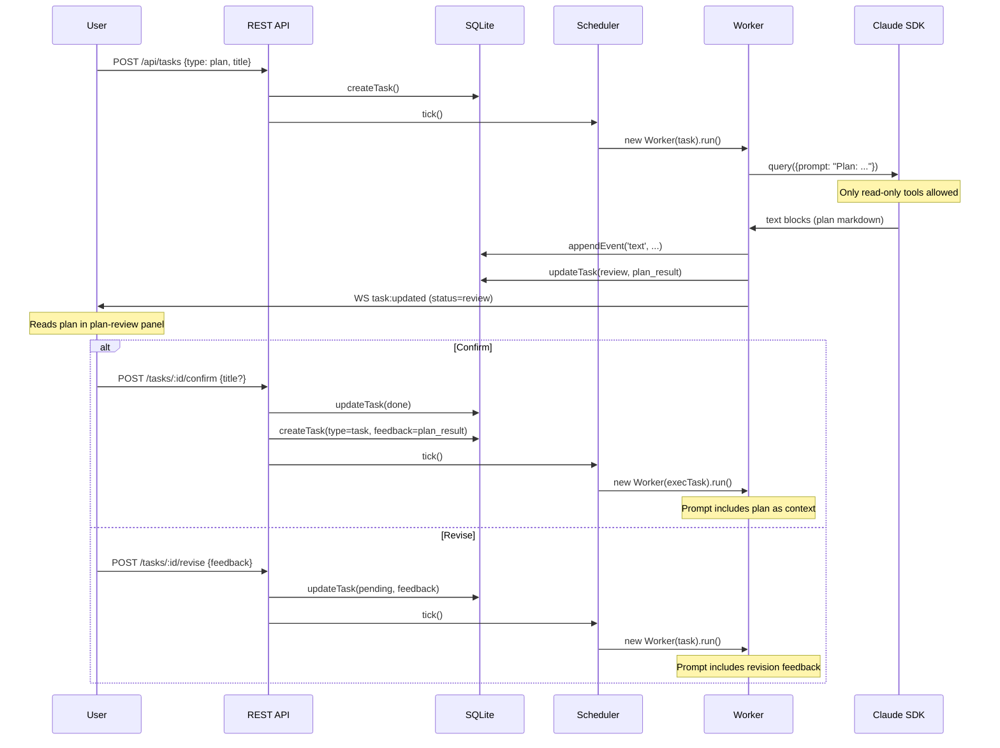

# Plan Review Flow

How plan tasks produce a markdown plan, present it for review,
and transition to execution.

## Flow

## Plan Task Restrictions

Plan tasks use `permissionMode: 'plan'` and only allow read-only tools:
Read, Glob, Grep, Task, WebSearch, WebFetch, TodoRead, TodoWrite.

Write tools (Write, Edit, Bash, NotebookEdit) are explicitly denied
by the `canUseTool` callback.

## Plan → Execution

When a plan is confirmed:

1. Plan task → status `done`
2. New task created with `type: task`
3. Plan's `plan_result` is stored as the execution task's `feedback`
4. Worker builds a prompt that includes the plan as context
