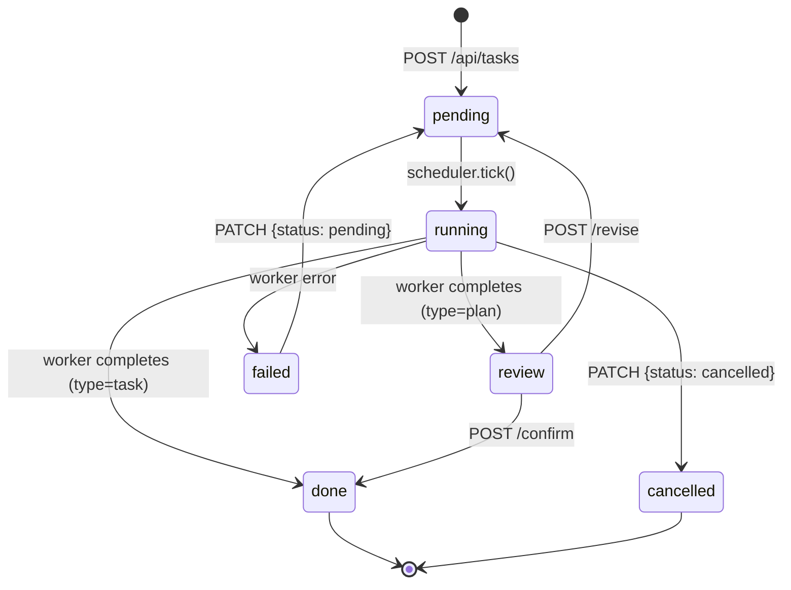
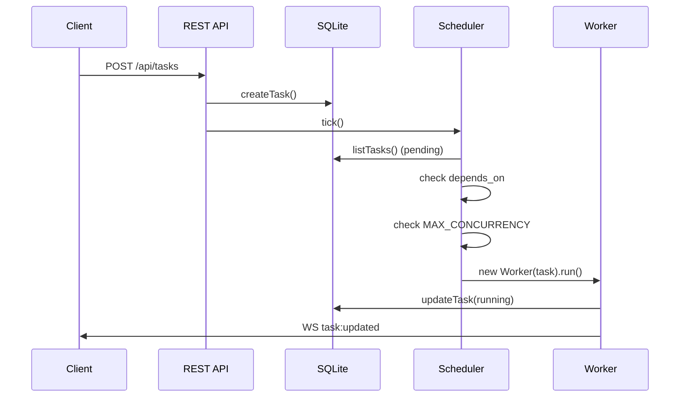

# Task Lifecycle

How a task moves through the system from creation to completion.

## State Machine

## Scheduling

## Storage

Two SQLite tables:

- **tasks** — current state of each task (status, cost, turns, timestamps)
- **task_events** — append-only log of everything a worker produces

Events are the source of truth for what happened during a run.
Tasks are the source of truth for the current state.

## Completion

When a worker finishes:

1. If `type=plan`: status → `review`, text chunks joined into `plan_result`
2. If `type=task`: status → `done`
3. `turns` and `cost_usd` are updated
4. `ended_at` is set

## Failure

On any unhandled error:

1. Error event appended to task_events
2. Status → `failed`
3. User can retry (PATCH to `pending`)

## Cancellation

User sends PATCH `{status: "cancelled"}` → worker.abort() → SDK `.interrupt()` → status → `cancelled`.
